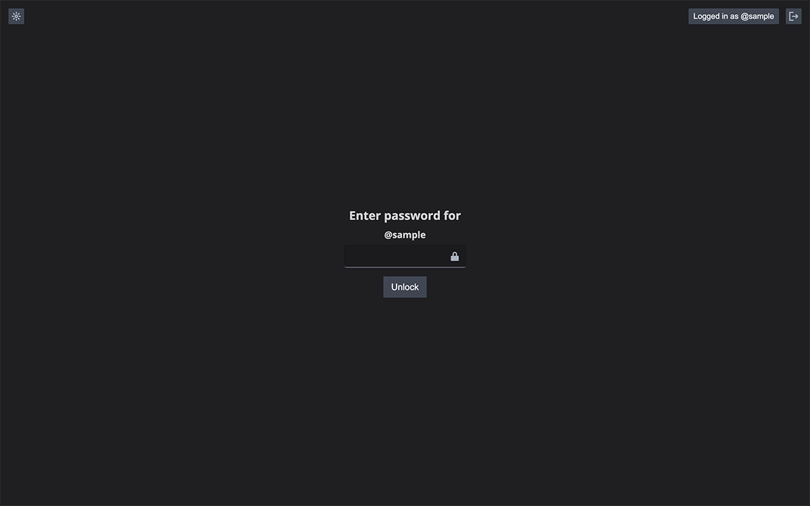

# Journal

## Table of Content

- [Live Demo](#live-demo)
- [Final Product](#final-product)
- [Getting Started](#getting-started)
- [Dependencies](#dependencies)
- [Credit](#credit)

## Live demo

This project was deployed to [Netlify](https://www.netlify.com/):
https://the-journals.netlify.app/

The [server](https://pet--api.herokuapp.com/) is deployed to [Heroku](https://journal---api.herokuapp.com/).

## Final Product

Users can:

- Start writing journal on the editor with various style (bold, italic, underlined, ordered list, unordered list). The status (Saving.../Saved) is shown at the bottom of the editor. It is only saved into the database (with [Axios](https://axios-http.com/)) when the content and title remained unchanged for 3 seconds. Word count is shown at the bottom of the editor
- Can pick journal of another date by clicking on the calendar / the list under the search bar. All the previous non-empty journals and the journals (even if empty) for the last month can be view and edit
- Search journals by typing into the search bar. The result list is only updated when the input remained unchanged for 0.5 second
- Toggle mode (bright/dark mode) by clicking the button on the top left. This preference is stored with [cookie-session](https://github.com/expressjs/cookie-session)
- Logout by clicking the button on the top right. The username is also shown beside the button

### Lock

The app is locked when:

- The window is first loaded (if user is logged in)
- The window is inactive (no mouse/keyboard movement) for 3 minutes

The user has to entered the password to unlock.

### Responsive Design

- View on tablet
  

- View on phone
  

### Error Handling

### Log in / Register

## Getting Started

1. Clone or download this repository onto your local device.
2. `cd` to the folder where this project is cloned.
3. Install all dependencies with `npm install` commands in the client and server folder.
4. Create a `/server/.env` file by copying the contents from `/server/development.env`:

- Set up your [PostgreSQL](https://www.postgresql.org/) database for this project and fill in the values for `DB_HOST`, `DB_USER`, `DB_PASS` and `DB_NAME`
- Fill in the `SECRET` value for the cookie sessions

5. Create tables in the database with the files in `server/db/schema` by running `npm run db:reset` in the server folder.
6. Run the server with `npm start` command in the server folder.
7. Run the app in the development mode with `npm start` command in the client server.
8. Open the broswer and visit: [http://localhost:3000/](http://localhost:3000/).

## Dependencies

### Client

- [React](https://en.reactjs.org/)
- [Redux](https://redux.js.org/)
- [Redux Thunk](https://github.com/reduxjs/redux-thunk)
- [React Redux](https://react-redux.js.org/)
- [Draft.js](https://draftjs.org/)
- [Axios](https://axios-http.com/)
- [Moment.js](https://momentjs.com/)
- [Blueprint](https://blueprintjs.com/)

### Server

- [Express](https://expressjs.com/)
- [cookie-session](https://github.com/expressjs/cookie-session)
- [bcrypt.js](https://github.com/dcodeIO/bcrypt.js)
- [pg](https://www.npmjs.com/package/pg)
- [nodemon](https://nodemon.io/): reload the server when there is a change in the file during development
- [Chalk](https://github.com/chalk/chalk)
- [Dotenv](https://github.com/motdotla/dotenv)

## Credits

- [Favicon](https://www.flaticon.com/free-icon/feather_96255) by [Freepik](https://www.flaticon.com/authors/freepik) on [Flaticon](https://www.flaticon.com/)
